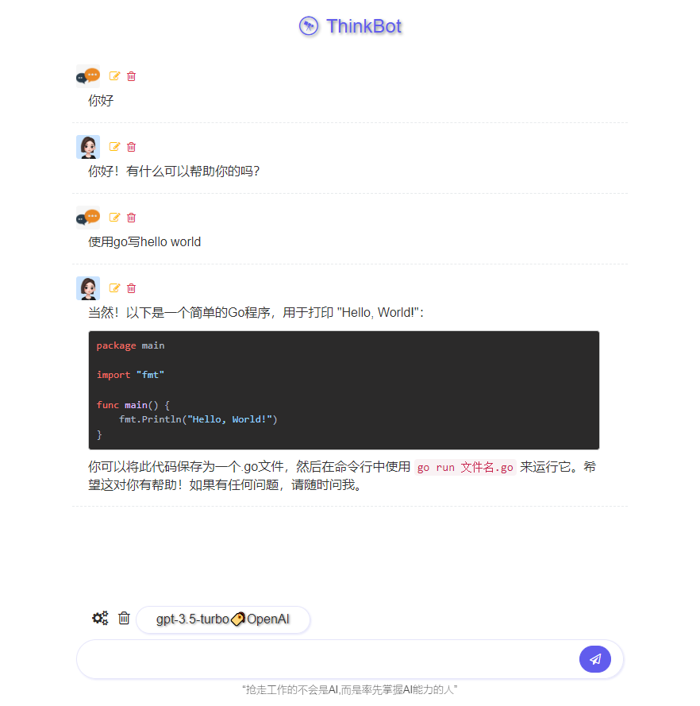
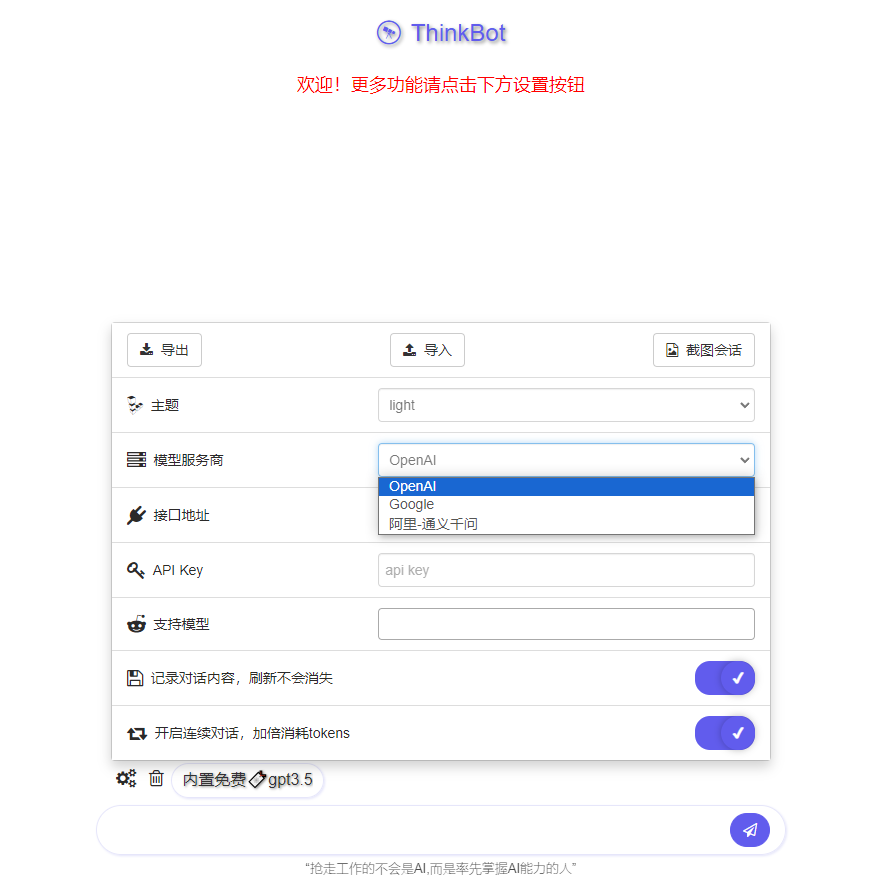
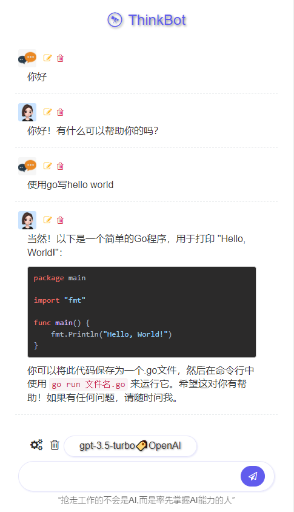

## ThinkBot

### 介绍

轻量级 AI 对话网站，支持 ChatGPT、通义千问等大模型，几秒钟搭建属于自己的 AI 问答机器人！

### 使用说明

打包（或下载）二进制文件后双击即可运行，无需安装任何环境，甚至连配置文件都不需要。

打包命令:

```
go build -ldflags "-s -w"
# 可选压缩，压缩后5MB左右
upx ThinkBot.exe
```

运行：
双击运行（默认端口 20093）或者命令行指定端口运行：`ThinkBot.exe -port 50000`

浏览器访问：http://127.0.0.1:20093

### 功能

<table>
    <tr>
        <td ><center>图1</center></td>
        <td ><center>图2</center></td>
    </tr>
</table>
<table>
    <tr>
        <td ><center>图3</center></td>
    </tr>
</table>

### 感谢

https://github.com/Aniuyyds/ChatGPT-website
